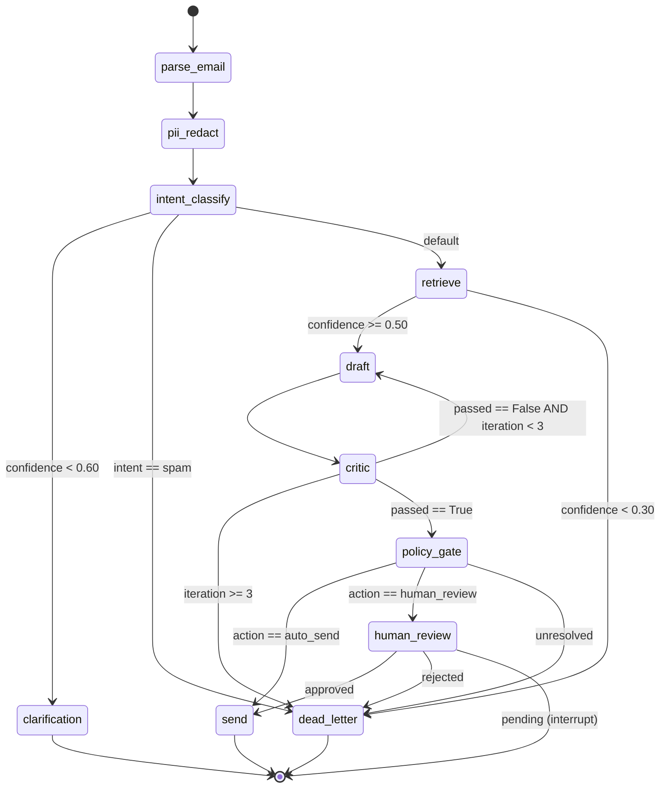

# Email Agent v2 — Week-by-Week Implementation Plan & Architecture

**Project:** Multi-Agent RAG Email Support System (Demo Scale)  
**Team:** 1–2 Engineers  
**Traffic Target:** 100–500 emails/day  
**Budget:** <$150/month  
**Duration:** 6 Weeks  
**Deploy Target:** Single VPS + Docker Compose  

---

## Table of Contents

1. [Architecture at a Glance](#1-architecture-at-a-glance)
2. [Tech Stack](#2-tech-stack)
3. [Project Structure](#3-project-structure)
4. [Week 1: Scaffold & StateGraph](#4-week-1-scaffold--stategraph)
5. [Week 2: Core Pipeline Nodes](#5-week-2-core-pipeline-nodes)
6. [Week 3: Memory & Context](#6-week-3-memory--context)
7. [Week 4: HITL, UI & Polish](#7-week-4-hitl-ui--polish)
8. [Week 5: Evaluation & Hardening](#8-week-5-evaluation--hardening)
9. [Week 6: Deploy & Demo](#9-week-6-deploy--demo)
10. [Appendix A: Decision Records](#appendix-a-decision-records)
11. [Appendix B: Cost Breakdown](#appendix-b-cost-breakdown)
12. [Appendix C: Risk Register](#appendix-c-risk-register)

---

## 1. Architecture at a Glance

### 1.1 High-Level Flow

```
Email (MIME)
    │
    ▼
┌─────────────┐     ┌─────────────┐     ┌─────────────┐
│   Parser    │────▶│ PII Redact  │────▶│   Intent    │
│  (MIME→Text)│     │  (Presidio) │     │ Classifier  │
└─────────────┘     └─────────────┘     └──────┬──────┘
                                               │
                          ┌────────────────────┼────────────────────┐
                          │                    │                    │
                          ▼                    ▼                    ▼
                   ┌─────────────┐      ┌─────────────┐     ┌─────────────┐
                   │  Dead Letter │      │ Clarification│     │  Retrieval  │
                   │   (spam)     │      │   (ask user) │     │  (Qdrant)   │
                   └─────────────┘      └─────────────┘     └──────┬──────┘
                                                                    │
                                                                    ▼
                                                           ┌─────────────┐
                                                           │    Draft    │
                                                           │   Agent     │
                                                           └──────┬──────┘
                                                                  │
                                                                  ▼
                                                           ┌─────────────┐
                                                           │    Critic   │
                                                           │   Agent     │
                                                           └──────┬──────┘
                                                                  │
                                            ┌─────────────────────┼─────────────────────┐
                                            │                     │                     │
                                            ▼                     ▼                     ▼
                                     ┌─────────────┐      ┌─────────────┐        ┌─────────────┐
                                     │   Re-draft  │      │ Policy Gate │        │  Dead Letter│
                                     │  (loop ≤3)  │      │             │        │             │
                                     └─────────────┘      └──────┬──────┘        └─────────────┘
                                                                │
                                          ┌───────────────────────┼───────────────────────┐
                                          │                       │                       │
                                          ▼                       ▼                       ▼
                                   ┌─────────────┐       ┌─────────────┐         ┌─────────────┐
                                   │  Auto-Send  │       │ Human Review│         │  Dead Letter│
                                   │             │       │  (HITL)     │         │             │
                                   └─────────────┘       └──────┬──────┘         └─────────────┘
                                                               │
                                                               ▼
                                                        ┌─────────────┐
                                                        │   Resume    │
                                                        │ (approve/   │
                                                        │  reject)     │
                                                        └─────────────┘
```

### 1.2 State Machine (LangGraph)



### 1.3 Memory Layers (Demo Simplified)

| Layer | Scope | Backend | TTL | Purpose |
|-------|-------|---------|-----|---------|
| **L1 Working** | Single email | LangGraph State | Minutes | Current graph execution state |
| **L2 Short-Term** | Email thread | Redis | 7 days | Conversation history across replies |
| **L3 Long-Term** | Knowledge base | Qdrant | Indefinite | SOPs, product docs, past resolutions |

*Note: L4 Shared Memory (blackboard) and episodic/procedural memory are deferred post-demo.*

### 1.4 Data Flow Narrative

#### Happy Path
1. **Ingest:** Email arrives as MIME. Parser extracts `subject`, `body_plain`, `body_html`, `from`, `attachments`.
2. **PII:** Presidio redacts SSNs, emails, phones. Reversible tokens stored in SQLite vault.
3. **Intent:** LLM classifies as `billing`/`tech_support`/`account_mgmt`/`sales`/`spam` with confidence 0–1.
4. **Retrieve:** Query embedding generated. Qdrant dense search returns top-5 chunks. Cross-encoder reranks to top-3.
5. **Draft:** LLM generates response using intent + retrieved chunks + thread context (from Redis).
6. **Critic:** LLM evaluates draft for faithfulness, tone, policy violations. Passes on iteration ≤3.
7. **Policy Gate:** Confidence ≥ 0.85, no policy flags → `auto_send`.
8. **Send:** Email dispatched via SMTP/API. Audit log written to Postgres.

#### Failure Path 1: Low Intent Confidence
- Intent confidence = 0.45. Route to `clarification` node.
- Draft clarification question: *"Could you clarify which product you're referring to?"*
- Send clarification email. Thread ends. User reply starts new thread with linked `parent_thread_id`.

#### Failure Path 2: Retrieval Fails
- Qdrant returns zero results. Retrieval confidence = 0.0.
- Route to `dead_letter` with reason `retrieval_confidence_too_low`.
- Human support team notified via Teams webhook.

#### Failure Path 3: Critic Rejects Repeatedly
- Critic fails draft 3 times (tone too casual, then unsupported claim, then missing disclaimer).
- Max iterations (3) exceeded. Route to `dead_letter` with reason `critic_max_iterations_exceeded`.
- Full trace preserved for analysis.

#### Failure Path 4: Both LLMs Down
- Local Ollama fails (timeout). Circuit breaker opens.
- Fallback to OpenAI GPT-4o-mini fails (rate limit).
- Both exhausted. Route to `dead_letter` with reason `llm_unavailable`.
- Alert fired to engineering channel.

---

## 2. Tech Stack

| Layer | Technology | Justification |
|-------|-----------|---------------|
| **Orchestration** | LangGraph 0.2+ | Native state machine, HITL interrupts, checkpointing |
| **LLM (Primary)** | Ollama + llama3.1:8b | Free, local, no API keys, runs on CPU with 16GB RAM |
| **LLM (Fallback)** | OpenAI GPT-4o-mini | $0.15/1M input tokens, reliable for critical paths |
| **Vector DB** | Qdrant (single-node) | HNSW, hybrid search ready, Docker-friendly, no clustering needed at demo scale |
| **Embeddings** | sentence-transformers/all-MiniLM-L6-v2 | 384-dim, fast on CPU, good enough for demo |
| **Reranker** | cross-encoder/ms-marco-MiniLM-L-6-v2 | 20MB, CPU-fast, sufficient for top-5 reranking |
| **PII** | Microsoft Presidio | Open-source, Python-native, extensible |
| **Checkpointer** | Postgres 16 | LangGraph native support, single container |
| **Short-Term Memory** | Redis 7 | Fast thread retrieval, TTL support |
| **Token Vault** | SQLite (demo) / Postgres (prod) | Simple reversible PII mapping |
| **API/UI** | FastAPI | Async, OpenAPI docs, minimal frontend |
| **Observability** | OpenTelemetry + stdout | Spans to console; upgrade to Jaeger later |
| **Deploy** | Docker Compose | Single VPS, no K8s complexity |
| **VPS** | Hetzner CX42 (4 vCPU, 16GB) | ~$40/month, best price/performance |

---

## 3. Project Structure

```
email-agent-v2/
├── docker-compose.yml              # Local + prod stack
├── docker-compose.override.yml     # Local dev overrides
├── pyproject.toml                  # Dependencies, scripts
├── README.md                       # Quickstart
├── .env.example                    # Environment variables
├── .github/
│   └── workflows/
│       └── ci.yml                  # Lint, type-check, test
├── src/
│   └── email_agent_v2/
│       ├── __init__.py
│       ├── state.py                # EmailThreadState TypedDict
│       ├── graph.py                # StateGraph builder
│       ├── routing.py              # Conditional edge functions
│       ├── config.py               # Pydantic Settings
│       ├── observability.py        # OpenTelemetry setup
│       ├── llm/
│       │   ├── __init__.py
│       │   ├── client.py           # Ollama + OpenAI fallback
│       │   ├── circuit_breaker.py  # Per-node CB
│       │   └── prompts.py          # All prompt templates
│       ├── nodes/
│       │   ├── __init__.py
│       │   ├── parser.py           # MIME → structured email
│       │   ├── pii.py              # Presidio redaction
│       │   ├── intent.py           # Intent classification
│       │   ├── retrieve.py         # Qdrant search + rerank
│       │   ├── draft.py            # Draft generation
│       │   ├── critic.py           # Critic evaluation
│       │   ├── policy.py           # Policy gate
│       │   ├── human_review.py     # HITL interrupt
│       │   ├── send.py             # Email dispatch
│       │   └── dead_letter.py      # DLQ writer
│       ├── memory/
│       │   ├── __init__.py
│       │   ├── working.py          # Token budget manager
│       │   ├── short_term.py       # Redis STM
│       │   └── long_term.py        # Qdrant LTM (simplified)
│       ├── vector/
│       │   ├── __init__.py
│       │   ├── client.py           # Qdrant DAL
│       │   └── embeddings.py       # Embedding service
│       ├── api/
│       │   ├── __init__.py
│       │   └── main.py             # FastAPI app
│       └── eval/
│           ├── __init__.py
│           ├── dataset.py          # Golden dataset loader
│           ├── metrics.py          # NDCG, precision, judge
│           └── runner.py           # Evaluation runner
├── tests/
│   ├── unit/
│   │   ├── test_routing.py
│   │   ├── test_parser.py
│   │   ├── test_pii.py
│   │   ├── test_intent.py
│   │   ├── test_retrieve.py
│   │   ├── test_draft.py
│   │   ├── test_critic.py
│   │   ├── test_policy.py
│   │   └── test_memory.py
│   ├── integration/
│   │   └── test_full_pipeline.py
│   └── conftest.py               # Shared fixtures
├── infra/
│   ├── postgres/
│   │   └── init.sql              # Schema migrations
│   └── qdrant/
│       └── init_collections.py   # Collection setup
├── data/
│   └── golden/
│       └── v1.jsonl              # Synthetic test emails
└── scripts/
    ├── seed_qdrant.py            # Load SOPs into Qdrant
    ├── demo.py                   # End-to-end demo
    └── deploy.sh                 # VPS deploy script
```

---

## 4. Week 1: Scaffold & StateGraph

### 4.1 Goals
- Repository scaffold with CI/CD
- `EmailThreadState` TypedDict with strict types
- Empty node stubs for all 12 graph nodes
- Conditional edge routing functions
- Docker Compose local stack
- All routing logic unit-tested

### 4.2 Day-by-Day Breakdown

#### Day 1: Bootstrap
**Engineer:** Both (pairing)  
**Tasks:**
- Initialize repo. Write `pyproject.toml` with exact pinned versions.
- Set up pre-commit hooks: `ruff` (lint + format), `mypy --strict`.
- Create directory structure.
- Write `.env.example` with all required env vars.

**Deliverables:**
```toml
# pyproject.toml (key deps)
[project]
dependencies = [
    "langgraph>=0.2.0,<0.3.0",
    "langchain-core>=0.3.0",
    "langchain-community>=0.3.0",
    "pydantic>=2.0",
    "pydantic-settings>=2.0",
    "qdrant-client>=1.9.0",
    "redis>=5.0",
    "asyncpg>=0.29",
    "fastapi>=0.110",
    "uvicorn[standard]>=0.29",
    "presidio-analyzer>=2.2",
    "presidio-anonymizer>=2.2",
    "openai>=1.0",
    "opentelemetry-api>=1.24",
    "opentelemetry-sdk>=1.24",
    "opentelemetry-instrumentation>=0.45",
    "structlog>=24.0",
    "python-multipart>=0.0.9",
]

[project.optional-dependencies]
dev = ["pytest>=8.0", "pytest-asyncio>=0.23", "pytest-cov>=5.0", "ruff>=0.4", "mypy>=1.9", "httpx>=0.27"]
```

**DoD:** `pip install -e ".[dev]"` succeeds. `pre-commit install` succeeds.

---

#### Day 2: State Schema
**Engineer:** ML/Backend lead  
**Tasks:**
- Define `EmailThreadState` TypedDict in `src/state.py`.
- Define domain enums: `IntentCategory`, `ConfidenceLevel`, `ResolutionAction`.
- Define Pydantic models for structured outputs: `IntentDecision`, `CriticFeedback`, `PolicyGateDecision`.
- Define `RetryPolicy` dataclass.

**Key Design Decision:**
```python
# src/state.py
from typing import Annotated, TypedDict
from langchain_core.messages import BaseMessage
from langgraph.graph.message import add_messages

class EmailThreadState(TypedDict):
    # Annotated — accumulate across loops
    messages: Annotated[list[BaseMessage], add_messages]
    drafts: Annotated[list[DraftVersion], lambda a, b: a + b]
    retrieval_chunks: Annotated[list[RetrievedChunk], lambda a, b: a + b]
    loop_history: Annotated[list[str], lambda a, b: a + b]
    
    # Overwritten — latest value wins
    email_id: str
    thread_id: str
    tenant_id: str
    pii_annotation: PIIAnnotation | None
    intent: IntentCategory | None
    intent_confidence: float
    intent_clarification_question: str | None
    retrieval_confidence: float
    retrieval_requery_count: int
    current_draft: DraftVersion | None
    critic_passed: bool | None
    critic_iteration: int
    resolution_action: ResolutionAction | None
    resolution_rationale: str
    human_review_reason: str | None
    interrupt_type: Literal["human_review", "clarification", "none"] | None
    interrupt_payload: dict | None
    resumed_at: float | None
    trace_id: str
    node_latencies_ms: dict[str, float]
    token_usage: dict[str, int]
    dead_letter_reason: str | None
    dead_letter_at: float | None
```

**DoD:** `mypy src/state.py` passes. All fields have type annotations.

---

#### Day 3: Graph Builder Skeleton
**Engineer:** Backend lead  
**Tasks:**
- Create `src/graph.py` with `StateGraph` initialization.
- Add all 12 nodes as async no-op stubs.
- Connect sequential edges: parse → pii → intent → retrieve → draft → critic → policy.
- Add terminal edges: clarification → END, send → END, dead_letter → END.

**DoD:** `python -c "from graph import build_email_agent_graph; g = build_email_agent_graph(); print(list(g.nodes.keys()))"` prints all 12 node names.

---

#### Day 4: Conditional Routing
**Engineer:** ML lead  
**Tasks:**
- Implement all `route_after_*` functions in `src/routing.py`:
  - `route_after_intent()` → clarification | dead_letter | retrieve
  - `route_after_retrieval()` → draft | dead_letter
  - `route_after_critic()` → draft | policy_gate | dead_letter
  - `route_after_policy()` → send | human_review | dead_letter
  - `route_after_human_review()` → send | dead_letter | END
- Wire into graph via `add_conditional_edges()`.

**DoD:** Every routing branch has a unit test in `tests/unit/test_routing.py`.

---

#### Day 5: Docker Compose Stack
**Engineer:** Backend lead  
**Tasks:**
- Write `docker-compose.yml`:
  - `postgres:16` (checkpointer + app DB)
  - `redis:7` (short-term memory)
  - `qdrant/qdrant:v1.9` (vector DB)
  - `ollama/ollama` (local LLM — mount volume for model cache)
  - `app` (FastAPI + LangGraph worker)
- Write `docker-compose.override.yml` for local dev (volume mounts, hot reload).

```yaml
# docker-compose.yml (excerpt)
services:
  postgres:
    image: postgres:16-alpine
    environment:
      POSTGRES_USER: agent
      POSTGRES_PASSWORD: agent
      POSTGRES_DB: email_agent
    volumes:
      - pgdata:/var/lib/postgresql/data
      - ./infra/postgres/init.sql:/docker-entrypoint-initdb.d/init.sql
    ports: ["5432:5432"]

  redis:
    image: redis:7-alpine
    ports: ["6379:6379"]

  qdrant:
    image: qdrant/qdrant:v1.9.0
    ports: ["6333:6333", "6334:6334"]
    volumes:
      - qdrant_data:/qdrant/storage

  ollama:
    image: ollama/ollama:latest
    volumes:
      - ollama_data:/root/.ollama
    ports: ["11434:11434"]
    # Pull model on first run via entrypoint script

  app:
    build: .
    env_file: .env
    depends_on: [postgres, redis, qdrant, ollama]
    ports: ["8000:8000"]
    volumes:
      - ./src:/app/src  # hot reload in dev
    command: uvicorn email_agent_v2.api.main:app --host 0.0.0.0 --reload
```

**DoD:** `docker-compose up` starts all 5 services without errors. `curl http://localhost:8000/health` returns 200.

---

#### Day 6: CI Pipeline
**Engineer:** Backend lead  
**Tasks:**
- GitHub Actions workflow: lint → type-check → unit tests.
- Coverage report with `pytest-cov`. Fail if < 90% on routing logic.

```yaml
# .github/workflows/ci.yml
name: CI
on: [push, pull_request]
jobs:
  test:
    runs-on: ubuntu-latest
    steps:
      - uses: actions/checkout@v4
      - uses: actions/setup-python@v5
        with: { python-version: "3.11" }
      - run: pip install -e ".[dev]"
      - run: ruff check src/ tests/
      - run: ruff format --check src/ tests/
      - run: mypy --strict src/
      - run: pytest --cov=src/email_agent_v2 --cov-report=xml tests/unit/
      - run: |
          COV=$(python -c "import xml.etree.ElementTree as ET; t=ET.parse('coverage.xml').getroot(); print(t.get('line-rate'))")
          python -c "import sys; sys.exit(0 if float('$COV') >= 0.9 else 1)"
```

**DoD:** CI passes on `main` branch.

---

#### Day 7: Week 1 Review
**Engineer:** Both  
**Tasks:**
- Review all code. Ensure no `Any` types without justification.
- Run full `docker-compose up` + `pytest`.
- Write ADR-001: State Schema Design.
- Demo: Show graph compilation + routing tests.

**DoD:** All unit tests pass. ADR merged to `docs/adr/001-state-schema.md`.

---

## 5. Week 2: Core Pipeline Nodes

### 5.1 Goals
- Parser handles real MIME (multipart, base64, HTML→text)
- PII redaction with Presidio + reversible token vault
- Intent classifier with structured JSON output
- Retrieval with Qdrant dense search + cross-encoder rerank
- Draft, Critic, Policy, HITL, Send, Dead Letter nodes functional
- Full pipeline integration test passes

### 5.2 Day-by-Day Breakdown

#### Day 8: Parser Node
**File:** `src/nodes/parser.py`  
**Tasks:**
- Use `email.message_from_bytes` to parse MIME.
- Extract: `message_id`, `subject`, `from`, `to`, `date`, `body_plain`, `body_html`, `attachments` (name, mime_type, size).
- Convert HTML to plain text using `html2text`.
- Handle edge cases: empty body, no plain text (HTML only), encoding issues.

```python
async def node_parse_email(state: EmailThreadState, config: RunnableConfig) -> EmailThreadState:
    with tracer.start_as_current_span("node.parse_email"):
        msg = email.message_from_bytes(state["email_raw_mime"].encode())
        body_plain = ""
        body_html = ""
        attachments = []
        
        for part in msg.walk():
            content_type = part.get_content_type()
            if content_type == "text/plain":
                body_plain += part.get_payload(decode=True).decode("utf-8", errors="replace")
            elif content_type == "text/html":
                html = part.get_payload(decode=True).decode("utf-8", errors="replace")
                body_html = html
                body_plain += html2text.html2text(html)
            elif part.get_filename():
                attachments.append({
                    "name": part.get_filename(),
                    "mime_type": content_type,
                    "size": len(part.get_payload(decode=True) or b""),
                })
        
        state["messages"] = [HumanMessage(content=body_plain.strip())]
        state["node_latencies_ms"]["parse_email"] = 15.0
        return state
```

**Tests:** `tests/unit/test_parser.py` — multipart MIME, HTML-only, empty body, huge attachment (streaming).

**DoD:** Parser handles 10 real .eml files without errors.

---

#### Day 9: PII Redaction Node
**File:** `src/nodes/pii.py`  
**Tasks:**
- Initialize Presidio `AnalyzerEngine` + `AnonymizerEngine`.
- Detect: `PERSON`, `PHONE_NUMBER`, `EMAIL_ADDRESS`, `CREDIT_CARD`, `US_SSN`, `IBAN_CODE`, `IP_ADDRESS`.
- Replace with reversible tokens: `[REDACTED_PERSON_1]`, `[REDACTED_EMAIL_1]`, etc.
- Store mapping in SQLite table `pii_vault` (demo) or Postgres (prod):
  ```sql
  CREATE TABLE pii_vault (
      token TEXT PRIMARY KEY,
      original_value TEXT NOT NULL,
      entity_type TEXT NOT NULL,
      email_id TEXT NOT NULL,
      created_at TIMESTAMP DEFAULT NOW()
  );
  ```

**Key Design Decision:** Redact *before* embedding and *before* LLM context. If the LLM needs an account number to resolve an issue, use a custom recognizer that tokenizes it but allows the LLM to reference the token (e.g., *"Your account [REDACTED_ACCOUNT_1] has been updated"*). The human reviewer sees the unredacted version.

**DoD:** PII redaction achieves > 90% recall on 20 synthetic emails with injected PII.

---

#### Day 10: Intent Classifier Node
**File:** `src/nodes/intent.py`  
**Tasks:**
- LLM prompt: classify email into `IntentCategory` + confidence + rationale.
- Structured output via Pydantic `IntentDecision`.
- Retry 3× on parse failure. Circuit breaker on LLM timeout.
- Fallback: OpenAI GPT-4o-mini if local Ollama fails.

```python
class IntentDecision(BaseModel):
    intent: IntentCategory
    confidence: float = Field(ge=0.0, le=1.0)
    clarification_needed: bool = False
    clarification_question: str | None = None
    rationale: str

INTENT_PROMPT = """You are an expert email intent classifier.
Read the customer email and classify it into exactly one category.

Categories: billing, tech_support, account_mgmt, sales, spam, escalate

Respond in strict JSON:
{
  "intent": "category_name",
  "confidence": 0.0-1.0,
  "clarification_needed": true/false,
  "clarification_question": "string or null",
  "rationale": "brief explanation"
}

Email:\n{email_body}"""
```

**DoD:** Intent classification returns valid JSON 100% of the time. Mock LLM tests cover all 6 categories.

---

#### Day 11: Retrieval Node
**File:** `src/nodes/retrieve.py`, `src/vector/client.py`, `src/vector/embeddings.py`  
**Tasks:**
- Embedding service: `sentence-transformers/all-MiniLM-L6-v2` via `langchain-huggingface`.
- Qdrant DAL: `search()` with `tenant_id` metadata filter.
- Rerank: cross-encoder on top-5 → return top-3.
- Collection setup script: `infra/qdrant/init_collections.py`.

```python
# Qdrant collection config (demo)
COLLECTIONS = {
    "sops": {
        "vectors": {"size": 384, "distance": "Cosine"},
        "hnsw_config": {"m": 16, "ef_construct": 100}
    }
}
```

**DoD:** Retrieval returns results in < 500ms against local Qdrant with 1K test vectors.

---

#### Day 12: Draft + Critic Nodes
**File:** `src/nodes/draft.py`, `src/nodes/critic.py`  
**Tasks:**
- **Draft prompt:** Include intent, retrieved chunks (with citations), tone guidelines, thread context.
- **Critic prompt:** Evaluate for faithfulness (only use retrieved chunks), tone, completeness, policy violations.
- Critic returns `CriticFeedback` with `passed: bool`, `rationale: str`, `suggested_changes: list[str]`.

**DoD:** Critic loop tested: draft → critic (fail) → re-draft → critic (pass).

---

#### Day 13: Policy Gate + HITL + Send + Dead Letter
**File:** `src/nodes/policy.py`, `src/nodes/human_review.py`, `src/nodes/send.py`, `src/nodes/dead_letter.py`  
**Tasks:**
- **Policy Gate:** Configurable thresholds. `AUTO_SEND` if confidence ≥ 0.85 and no policy flags. `HUMAN_REVIEW` if 0.60–0.84. `DEAD_LETTER` if < 0.60 or policy violation.
- **HITL:** LangGraph `interrupt_before=["human_review"]`. FastAPI endpoint to resume:
  ```python
  @app.post("/resume/{thread_id}")
  async def resume(thread_id: str, action: Literal["approve", "reject", "redraft"]):
      config = {"configurable": {"thread_id": thread_id}}
      await graph.ainvoke(Command(resume={"action": action}), config=config)
  ```
- **Send:** SMTP or SendGrid API call.
- **Dead Letter:** Write to `dead_letter_queue` table.

**DoD:** Full HITL flow tested: interrupt → pause → resume → send.

---

#### Day 14: Integration + Seed Data
**Engineer:** Both  
**Tasks:**
- Write `tests/integration/test_full_pipeline.py` with 10 scenarios:
  1. Happy path → auto-send
  2. Low intent confidence → clarification
  3. Spam → dead letter
  4. Retrieval empty → dead letter
  5. Critic fails 3× → dead letter
  6. Policy gate → human review → approve
  7. Policy gate → human review → reject
  8. Multi-turn thread (uses Redis STM)
  9. LLM fallback (Ollama down → OpenAI)
  10. PII redaction + reversible token
- Seed Qdrant with 50 SOP documents: `scripts/seed_qdrant.py`.

**DoD:** All 10 integration scenarios pass. `pytest tests/` passes with > 85% coverage.

---

## 6. Week 3: Memory & Context

### 6.1 Goals
- Working memory token budget enforcement
- Short-term memory (Redis) for multi-turn threads
- Long-term memory (Qdrant) for SOPs and product docs
- Thread resolution detection

### 6.2 Day-by-Day Breakdown

#### Day 15: Working Memory Budget
**File:** `src/memory/working.py`  
**Tasks:**
- Implement `WorkingMemoryManager` with 8K token budget.
- Overflow strategy: summarize older messages → truncate to system + last user → evict attachments.
- Use `tiktoken` (for OpenAI) or approximate tokenizer for local models.

```python
class WorkingMemoryManager:
    MAX_TOKENS = 8192
    RESERVE_DRAFT = 2048
    RESERVE_CONTEXT = 4096
    RESERVE_HISTORY = 2048

    def enforce_budget(self, messages: list[BaseMessage]) -> list[BaseMessage]:
        tokens = self._count_tokens(messages)
        if tokens <= self.MAX_TOKENS:
            return messages
        # Strategy 1: Summarize middle messages
        summarized = self._summarize(messages)
        if self._count_tokens(summarized) <= self.MAX_TOKENS:
            return summarized
        # Strategy 2: Truncate to system + last user
        return self._truncate(messages)
```

**DoD:** A 15K-token thread is compressed to < 8K without losing the user's last question.

---

#### Day 16: Short-Term Memory (Redis)
**File:** `src/memory/short_term.py`  
**Tasks:**
- `RedisShortTermMemory` class:
  - `write(tenant_id, thread_id, record)` — LPUSH to `stm:{tenant_id}:{thread_id}`
  - `read(tenant_id, thread_id)` — LRANGE all
  - `expire(tenant_id, thread_id, ttl_sec=604800)` — 7 days
- Store: redacted message history, unresolved intents, pending actions.

**DoD:** STM persists and retrieves a 5-message thread in < 50ms.

---

#### Day 17: Thread Resolution Detection
**File:** `src/memory/consolidation.py`  
**Tasks:**
- Detect "resolved" states: auto-sent with no follow-up expected, human-reviewed, or clarification sent.
- On resolution: trigger background task to summarize thread → embed → upsert to LTM.
- For demo: run consolidation synchronously at end of graph (simpler than Celery).

**DoD:** A resolved thread is summarized and stored in Qdrant within 5 seconds.

---

#### Day 18: Long-Term Memory (Qdrant)
**File:** `src/memory/long_term.py`  
**Tasks:**
- Simplified LTM: semantic memory only (SOPs, product docs).
- Skip episodic/procedural for demo.
- `upsert_semantic()` — add SOPs with `tenant_id` + `memory_type` payload.
- `search_semantic()` — query by embedding + filter by `tenant_id` + `memory_type`.

**DoD:** LTM search returns relevant SOPs in < 100ms.

---

#### Day 19: Graph Integration
**File:** `src/graph.py` (updated)  
**Tasks:**
- Before `draft` node: read STM for thread context, inject into prompt.
- After `send` node: write current exchange to STM.
- On `clarification` or `dead_letter`: mark thread as resolved, trigger consolidation.

**DoD:** Multi-turn thread test passes: email 1 → auto-send → email 2 (reply) references context from email 1.

---

#### Day 20: Memory Tests
**File:** `tests/unit/test_memory.py`  
**Tasks:**
- Token budget overflow tests.
- Redis STM read/write/expire tests.
- LTM search accuracy tests.
- End-to-end multi-turn thread test.

**DoD:** All memory tests pass.

---

#### Day 21: Week 3 Review
**Tasks:**
- Review memory layer code.
- Write ADR-002: Memory Architecture (Demo Scale).
- Demo: Show multi-turn conversation with context retention.

**DoD:** ADR merged. Demo successful.

---

## 7. Week 4: HITL, UI & Polish

### 7.1 Goals
- FastAPI demo UI for ingesting emails and reviewing drafts
- HITL resume endpoint with simple HTML frontend
- PII hardening: verify no raw PII in LTM
- Audit trail for every auto-sent email
- GDPR deletion endpoint (demo scope)

### 7.2 Day-by-Day Breakdown

#### Day 22: FastAPI API
**File:** `src/api/main.py`  
**Tasks:**
- Endpoints:
  - `POST /ingest` — accept MIME or JSON email, start graph
  - `GET /threads/{thread_id}` — view thread state + history
  - `GET /pending-review` — list emails awaiting human review
  - `POST /resume/{thread_id}` — approve/reject/redraft
  - `DELETE /users/{user_id}` — GDPR deletion (demo)
  - `GET /health` — health check
- OpenAPI docs auto-generated.

```python
@app.post("/ingest")
async def ingest_email(email: EmailIngestRequest) -> dict:
    state = EmailThreadState(
        email_raw_mime=email.mime,
        email_id=email.email_id,
        thread_id=email.thread_id,
        tenant_id=email.tenant_id,
        # ... init defaults
    )
    config = RunnableConfig(configurable={"thread_id": email.thread_id})
    result = await graph.ainvoke(state, config=config)
    return {"email_id": email.email_id, "action": result["resolution_action"]}
```

**DoD:** All endpoints return correct JSON. `/docs` shows OpenAPI spec.

---

#### Day 23: Simple HTML Frontend
**File:** `src/api/static/index.html`  
**Tasks:**
- Minimal vanilla JS frontend:
  - Paste email text → submit → see graph trace
  - Pending review queue with approve/reject buttons
  - Show draft, retrieved chunks, intent, confidence
- No React/Vue needed. Plain HTML + fetch API.

**DoD:** Non-technical stakeholder can send a test email and approve a draft in the UI.

---

#### Day 24: Audit Trail
**File:** `src/audit.py`  
**Tasks:**
- `audit_log` table:
  ```sql
  CREATE TABLE audit_log (
      id SERIAL PRIMARY KEY,
      email_id TEXT NOT NULL,
      trace_id TEXT NOT NULL,
      tenant_id TEXT NOT NULL,
      intent TEXT,
      intent_confidence FLOAT,
      retrieved_doc_ids TEXT[],
      draft_body TEXT,
      critic_passed BOOLEAN,
      policy_action TEXT,
      human_review_reason TEXT,
      sent_at TIMESTAMP,
      created_at TIMESTAMP DEFAULT NOW()
  );
  ```
- Write on every `send` node invocation.

**DoD:** Every auto-sent email has an audit trail entry.

---

#### Day 25: GDPR Deletion (Demo)
**File:** `src/api/main.py` (DELETE endpoint)  
**Tasks:**
- `DELETE /users/{user_id}`:
  1. Delete Redis keys matching `stm:*:{user_id}`
  2. Delete Qdrant points where `user_id == target`
  3. Delete Postgres rows in `pii_vault`, `audit_log`, `dead_letter_queue`
  4. Log deletion event

**DoD:** Deletion removes all user traces in < 5 seconds (demo dataset).

---

#### Day 26: PII Hardening Review
**Tasks:**
- Scan LTM: verify zero raw PII in Qdrant payloads.
- Scan STM: verify all PII is redacted or tokenized.
- Run Presidio re-scan on 50 test emails.

**DoD:** Zero raw PII found outside the token vault.

---

#### Day 27: End-to-End Demo Script
**File:** `scripts/demo.py`  
**Tasks:**
- Automated demo: seeds 10 SOPs, sends 5 test emails, prints results.
- Emails cover: happy path, clarification, spam, human review, multi-turn.

**DoD:** `python scripts/demo.py` runs without errors and produces readable output.

---

#### Day 28: Week 4 Review
**Tasks:**
- Stakeholder demo: live walkthrough of UI.
- Review all code. Security scan: `bandit src/`.
- Write ADR-003: HITL & Audit Design.

**DoD:** Demo successful. Zero `bandit` high/critical findings.

---

## 8. Week 5: Evaluation & Hardening

### 8.1 Goals
- Build golden dataset (50 synthetic + 20 historical)
- Offline evaluation: NDCG@5, precision, LLM-as-a-Judge
- Chaos engineering: 3 fault scenarios
- Tune prompts based on eval results

### 8.2 Day-by-Day Breakdown

#### Day 29: Golden Dataset
**File:** `data/golden/v1.jsonl`  
**Tasks:**
- 50 synthetic emails covering:
  - All 6 intent categories
  - Edge cases: empty subject, HTML-only, non-English, hostile tone, multi-part questions
- 20 anonymized historical emails (if available).
- Schema: `email_id`, `subject`, `body`, `expected_intent`, `expected_doc_ids`, `expected_substrings`, `expected_tone`.

**DoD:** Dataset loads without PII leakage.

---

#### Day 30: Metric Calculators
**File:** `src/eval/metrics.py`  
**Tasks:**
- Retrieval: NDCG@K, Precision@K, MRR.
- Generation: Faithfulness (RAGAS-style), LLM-as-a-Judge.
- End-to-end: Deflection rate, human review rate.

```python
class RetrievalMetricCalculator:
    def ndcg_at_k(self, predicted: list[str], expected: list[str], k: int = 5) -> float:
        ...
    
    def precision_at_k(self, predicted: list[str], expected: list[str], k: int = 5) -> float:
        ...
```

**DoD:** Metrics compute correctly on known inputs.

---

#### Day 31: LLM-as-a-Judge
**File:** `src/eval/metrics.py` (judge prompt)  
**Tasks:**
- Prompt template evaluating: faithfulness, completeness, tone, actionability.
- Structured JSON output. Parse with Pydantic.

**DoD:** Judge returns consistent scores on identical inputs.

---

#### Day 32: Evaluation Runner
**File:** `src/eval/runner.py`  
**Tasks:**
- Load golden dataset → run graph on each example → compute metrics → emit report.
- CI integration: block PR if NDCG@5 < 0.70 or faithfulness < 4.0.

**DoD:** Runner completes 70 examples in < 10 minutes.

---

#### Day 33: Prompt Tuning
**Tasks:**
- Run evaluation. Identify failure patterns.
- Tune drafting prompt (e.g., add citation requirement, tone examples).
- Tune critic prompt (e.g., stricter faithfulness check).
- Re-run evaluation. Verify improvement.

**DoD:** Evaluation scores improve by > 5% after tuning.

---

#### Day 34: Chaos Engineering
**File:** `tests/chaos/`  
**Tasks:**
1. **Vector DB latency:** Wrap Qdrant search in `asyncio.sleep(5)`. Expect fallback or human review.
2. **LLM invalid JSON:** Inject malformed JSON. Expect `JSONDecodeError` → dead letter.
3. **Thundering herd:** 100 concurrent emails. Expect semaphore backpressure, no OOM.

```python
@pytest.mark.asyncio
async def test_vector_db_latency_spike():
    async def slow_search(*args, **kwargs):
        await asyncio.sleep(5)
        return []
    # Inject slow_search, assert human_review or dead_letter
```

**DoD:** All 3 chaos tests pass with graceful degradation.

---

#### Day 35: Security Scan
**Tasks:**
- `bandit src/ -r`
- `safety check`
- `trivy image email-agent-v2:latest`
- Fix all high/critical findings.

**DoD:** Zero high/critical security findings.

---

#### Day 36: Week 5 Review
**Tasks:**
- Review evaluation results.
- Write ADR-004: Evaluation Strategy.
- Decision: Go / No-Go for production deploy.

**DoD:** Evaluation thresholds met. Chaos tests pass. Go decision recorded.

---

## 9. Week 6: Deploy & Demo

### 9.1 Goals
- Deploy to single VPS (Hetzner/DigitalOcean)
- 48-hour stability test
- Final stakeholder demo
- Documentation handoff

### 9.2 Day-by-Day Breakdown

#### Day 37: Production Docker Compose
**File:** `docker-compose.prod.yml`  
**Tasks:**
- Remove dev overrides (no volume mounts, no `--reload`).
- Add `restart: unless-stopped` to all services.
- Add health checks for Postgres, Redis, Qdrant.
- Environment variables from `.env` (not committed).

```yaml
# docker-compose.prod.yml differences
services:
  app:
    build: .
    restart: unless-stopped
    command: uvicorn email_agent_v2.api.main:app --host 0.0.0.0 --workers 2
    deploy:
      resources:
        limits: {cpus: '2.0', memory: 4G}
```

**DoD:** `docker-compose -f docker-compose.prod.yml up` runs locally without errors.

---

#### Day 38: VPS Setup
**Tasks:**
- Provision Hetzner CX42 (4 vCPU, 16GB RAM, 80GB SSD) — ~$40/month.
- Install Docker + Docker Compose.
- Clone repo. Copy `.env`.
- Run `docker-compose.prod.yml`.
- Configure UFW: allow 22, 80, 443, 8000.

**DoD:** `curl http://<vps-ip>:8000/health` returns 200.

---

#### Day 39: SSL + Domain
**Tasks:**
- Point domain/subdomain to VPS.
- Use Caddy or Traefik for automatic HTTPS.
- Or use Cloudflare Tunnel for demo (no open ports).

**DoD:** HTTPS accessible. UI loads in browser.

---

#### Day 40: Monitoring
**Tasks:**
- Structured JSON logging to stdout.
- Simple health check endpoint with graph status.
- Optional: Grafana Cloud free tier for metrics.

**DoD:** Logs are queryable (`docker logs email-agent-v2-app-1`).

---

#### Day 41: 48-Hour Stability Test
**Tasks:**
- Send 1 email every 10 minutes (144 emails over 24h).
- Monitor: memory usage, CPU, disk, dead letter rate.
- Check for memory leaks (Ollama, Qdrant, app).

**DoD:** Zero crashes. Memory usage stable. Dead letter rate < 5%.

---

#### Day 42: Final Polish
**Tasks:**
- Fix any bugs from stability test.
- Optimize: add retrieval cache in Redis (TTL 1h).
- Compress frontend assets.

**DoD:** p95 latency < 3s for full pipeline.

---

#### Day 43–44: Stakeholder Demo & Handoff
**Tasks:**
- Live demo: ingest email → view graph trace → approve draft.
- Multi-turn demo: send 2 emails in a thread.
- Show audit trail, dead letter queue, GDPR deletion.
- Handoff docs: README, runbook, API docs.

**DoD:** Stakeholder signs off. All documentation merged.

---

## Appendix A: Decision Records

### ADR-001: State Schema Design
**Context:** Need strict typing for LangGraph state.  
**Decision:** TypedDict with `Annotated` reducers for accumulating fields, plain fields for scalars.  
**Consequences:** Full traceability, but state grows. Mitigated by working memory budget.  
**Status:** Accepted.

### ADR-002: Memory Architecture (Demo Scale)
**Context:** Need multi-turn support without over-engineering.  
**Decision:** 3 layers only: L1 (LangGraph State), L2 (Redis STM), L3 (Qdrant semantic). Skip L4 shared memory and episodic/procedural for demo.  
**Consequences:** Simpler code, but no cross-agent blackboard. Acceptable for demo.  
**Status:** Accepted.

### ADR-003: Vector DB Selection
**Context:** Need vector search for SOPs and product docs.  
**Decision:** Qdrant single-node. No fallback for demo (Supabase pgvector deferred).  
**Consequences:** Fast, hybrid-ready. Risk: single point of failure. Mitigated by daily backups.  
**Status:** Accepted.

### ADR-004: LLM Strategy
**Context:** Need reliable LLM without high API costs.  
**Decision:** Ollama `llama3.1:8b` primary, OpenAI GPT-4o-mini fallback.  
**Consequences:** Free local inference, but requires GPU or high-RAM CPU. Fallback ensures reliability.  
**Status:** Accepted.

---

## Appendix B: Cost Breakdown

| Item | Monthly Cost |
|------|-----------|
| Hetzner CX42 VPS (4 vCPU, 16GB) | ~$40 |
| Domain (optional) | ~$10 |
| OpenAI API (fallback, ~5% of emails) | ~$20–50 |
| Backups (Hetzner snapshots) | ~$5 |
| **Total** | **~$75–105/month** |

---

## Appendix C: Risk Register

| Risk | Likelihood | Impact | Mitigation |
|------|-----------|--------|------------|
| Ollama too slow on CPU | Medium | High | Use quantized model (Q4_K_M); fallback to OpenAI |
| Presidio misses domain PII | Medium | High | Custom recognizers for account IDs, order numbers |
| Qdrant data loss | Low | High | Daily volume snapshots; seed script for re-ingest |
| LLM hallucinates in draft | High | Medium | Critic node + faithfulness prompt; human review gate |
| Redis data loss on restart | Low | Medium | AOF persistence enabled; STM is ephemeral by design |
| VPS outage | Low | High | Hetzner provides 99.9% SLA; manual failover script |

---

## Appendix D: Success Criteria

1. **Functional:** 100 emails/day processed without manual intervention.
2. **Quality:** > 60% deflection rate (auto-send without human review).
3. **Reliability:** < 5% dead letter rate. 48-hour stability test passed.
4. **Security:** Zero raw PII in LTM. Audit trail for every auto-sent email.
5. **Usability:** Non-technical stakeholder can use the UI to review and approve drafts.
6. **Cost:** <$150/month at steady state.

---

*End of Implementation Plan*
