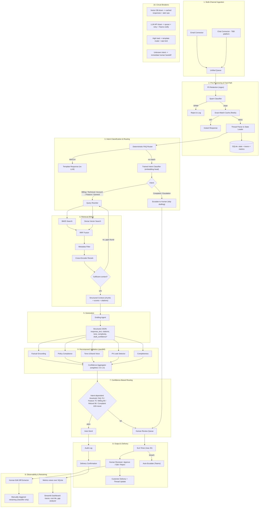

# TaskFlow AI Support Agent — Complete Project Context (v1, Full Architecture)

> **Purpose of this document:** paste this into a new LLM session (e.g. Claude Code) as the authoritative context for building TaskFlow v1. It supersedes every earlier version of the brief — this is the current, correct scope, current stack, and current architecture. Where anything here conflicts with an older document, this one wins.

---

## 1. What this is

**TaskFlow AI Support Agent** — an autonomous email + chat support agent with human-in-the-loop governance, built as a **solo, 3–4 week project** for an internship presentation to senior engineers and leadership.

This is **not a trimmed demo anymore** — the scope below is the real v1 architecture (what was previously drafted as a "v2.0" vision diagram), built for real. Fine-tuning the drafting LLM is the one deliberately deferred piece — everything else here is meant to be built and working.

- Solo developer, no team, no dedicated ML engineer.
- All data synthetic — one fictional tenant (`taskflow-demo`), no real customer data.
- English only.

---

## 2. Product narrative

TaskFlow is a fictional project-management SaaS (Free / Pro $12/user/mo / Enterprise $29/user/mo). The agent ingests support requests from email and chat, classifies intent with a trained classifier, retrieves relevant knowledge via hybrid search, drafts a grounded response, runs it through five independent validators, computes a composite confidence score, and either auto-sends or routes to a human — with a real approve/edit/reject action, an SLA timer, and auto-escalation on breach. Not a chatbot — an autonomous agent with governance you can actually inspect.

---

## 3. Constraints

- **Timeline: 3–4 weeks**, solo.
- **Fine-tuning the drafting LLM is deferred.** Hyper (the primary LLM provider) doesn't support fine-tuning — it's inference-only, optimized for coding workflows. Fine-tuning would require OpenAI's fine-tuning API specifically, real cost beyond free credits, and a training set larger than anything generated so far. Revisit post-v1.
- Redis and a Teams webhook are both in scope now — light lift, and Redis in particular reinforces the "production-ready" framing for the presentation.
- Still free-tier everywhere it doesn't cost real functionality (LLM credits, Qdrant local, Redis local/free tier, Render not needed yet — v1 deploys locally with screen share, not hosted).

---

## 4. Finalized stack

| Layer | Choice | Note |
|---|---|---|
| Primary LLM | Hyper API (hyper.charm.land) | OpenAI-compatible. Verify its models produce warm, natural support prose, not just code-flavored completions — its catalog is explicitly coding-optimized. |
| Fallback LLM | OpenAI GPT-4o-mini | Two providers total; Ollama and a third cloud fallback stay cut — resilience was ranked lowest priority. |
| Orchestration | LangGraph | State machine, conditional edges. |
| Vector DB | Qdrant (local Docker) | Hybrid: dense + sparse (BM25/SPLADE). |
| Dense embeddings | sentence-transformers (all-MiniLM-L6-v2) | Reused as the feature input for the intent classifier — one embedding model, two jobs. |
| Reranker | cross-encoder/ms-marco-MiniLM-L-6-v2 | |
| Intent classifier | **Trained** — logistic regression / small MLP head on frozen MiniLM embeddings | Not a fine-tuned transformer — trainable on CPU in minutes once training data exists. Needs its own labeled dataset, larger than the eval set (see §10). |
| Email | Gmail API (poll + send) | |
| Chat | **Real platform integration — platform TBD** | See §15, the one open item left. |
| Cache | Redis | Exact-match FAQ cache. |
| Conversation state + traces + metrics | **One SQLite store** | Conversation state, trace storage, and metrics/analytics views all live here — three "layers" in the diagram, one physical store. No reason for four separate databases in a solo build. |
| Pre-filter | Deterministic regex/keyword rules | |
| Policy engine | YAML rules + LLM verification | Critical rules block auto-send. |
| PII handling | Regex only | No NER (Presidio) — no real PII in synthetic data, not worth the dependency yet. |
| Alerting | Real Teams incoming webhook | ~30 minutes of work, more credible live than a repurposed Gmail notification. |
| Dashboard | Streamlit | Trace viewer, cost tile, retrieval gap analyzer. |
| Deployment (v1) | Local + screen share | Docker/Render stays roadmap. |

---

## 5. Architecture



`*draft_confidence` is logged, not used for routing — the actual decision comes only from the weighted Confidence Aggregator in §6, never an LLM's self-rating.

---

## 6. Confidence formula & thresholds

```
confidence = citation_coverage*0.30 + retrieval_relevance*0.25 + intent_confidence*0.15
           + policy_compliance*0.15 + tone_alignment*0.10 + thread_coherence*0.05
```

Weights are heuristic, not statistically calibrated — say so if asked, don't present them as tuned.

| Intent | Threshold |
|---|---|
| FAQ (account, billing, technical) | 70% |
| Feature request | 75% |
| Billing dispute | 80% |
| Refund request | 90% |
| Complaint / escalation | 100% — never auto-send, and pre-empted before drafting entirely |
| Off-topic / ambiguous | Always human review |

---

## 7. Build sequence (3–4 weeks)

**Week 1 — Foundations, data, fast path**
Scaffold + config · both LLM providers wired with fallback · generate the 42-doc knowledge base · generate the classifier training set (separate from the eval set — see §10) · Qdrant ingestion · pre-processing layer (PII regex, spam classifier, Redis exact-match cache, thread parser) · Gmail connector.

**Week 2 — Classification + retrieval + chat**
Deterministic FAQ router · train the intent classifier, evaluate on a held-out split · route to sub-flows, `Escalate (Human)` pre-empting drafting for complaint-type intents · full retrieval stack (query rewriter, BM25 + dense + RRF, reranker, sufficiency checker with multi-hop) · chat connector integration (platform TBD).

**Week 3 — Generation, validation, routing, delivery**
Drafting agent + structured JSON output + fallbacks · five parallel validators (grounding, policy, tone, PII-leak, completeness) · confidence aggregator using intent-dependent thresholds · human review queue with real Approve/Edit/Reject, SLA timer, auto-escalate, customer delivery.

**Week 4 — Observability, retraining, resilience, polish**
Streamlit dashboard (trace viewer, cost tile, retrieval gap analyzer) · human-edit diff extractor → manually-triggered classifier retraining script · circuit breakers (vector DB, LLM API, high load, unknown intent) · golden eval set validation pass · pre-flight dry-run of all 5 scenarios · docs, demo script · buffer days.

---

## 8. The 5 demo scenarios

1. **Exact FAQ match** — "How do I reset my password?" → instant, zero LLM cost.
2. **Complex billing dispute** — "I was charged twice for my Pro subscription" → retrieval + drafting + citation.
3. **Refund escalation** — "$750 refund for Enterprise" → policy engine blocks (>$500 ceiling), routes to human.
4. **Spam rejection** — "Win a free iPhone!" → pre-filter rejects before any LLM call.
5. **Ambiguous request** — "Your product is terrible, I want to talk to someone" → complaint intent, pre-empted straight to human review.

---

## 9. Data requirements — three separate datasets

| Dataset | Purpose | Status |
|---|---|---|
| Knowledge base (42 docs) | Retrieval/citation source | Generation prompt already written |
| Labeled query set (~55–65 rows) | Golden eval set + exact-FAQ seeds | Generation prompt already written — **stays held-out from classifier training** |
| Classifier training set | Train the intent classifier | **Not yet written** — needs low hundreds of examples per intent category, distinct from the eval set above, or the classifier's accuracy numbers become meaningless |

---

## 10. Success criteria

All 5 scenarios execute correctly · live demo survives an external API outage via circuit breakers · every trace is inspectable in Streamlit · zero unverifiable claims in auto-sent responses · zero policy violations · intent classifier accuracy is measured against a genuine held-out split, not just the 5 demo scenarios · code is typed, modular, production-minded.

---

## 11. Explicitly deferred (not this build)

- **LLM fine-tuning** — needs OpenAI's fine-tuning API specifically (Hyper doesn't support it), real cost, and a larger training set. Revisit once v1 is stable; likely means fine-tuned OpenAI model becomes primary, Hyper becomes fallback — a real flip worth deciding on purpose then.
- **Scheduled (cron) retraining** — v1 uses a manually-triggered script; that's enough to demo the mechanism.
- **Docker/Render hosted deployment** — v1 is local + screen share.
- **Multi-language, non-Gmail/non-chat channels, real PII/NER.**

---

## 12. Implementation principles

Type everything (Pydantic models for emails, chunks, traces, critic outputs, confidence scores) · log everything (structured JSON) · fail gracefully (every external call has a fallback) · no notebooks, production modules only · config over code (policies, thresholds, provider priority in YAML/JSON, not hardcoded).

---

## 13. Recommended documentation suite

Beyond this context document, here's what else is worth generating, roughly in the order you'll need them:

**Before coding starts**
- `ARCHITECTURE_DECISIONS.md` — the *why* behind each choice here (RRF fusion over plain hybrid, classifier-head-on-embeddings over full fine-tune, the confidence formula's weights, why 2 providers not 3). Without this, six months from now nobody — including you — remembers why a decision was made, and future changes risk quietly reversing something that was deliberate.
- `POLICY_RULES.md` — the ~10 concrete policy rules the YAML engine enforces (refund ceiling, no feature-date promises, no password requests, legal-threat escalation, GDPR deletion). This is the actual source the policy engine gets built from.
- `SCHEMAS.md` — Pydantic/JSON schema definitions for every structured object crossing a pipeline boundary (email, chunk, trace, critic output, confidence breakdown, drafting agent's JSON). Define these once, shared, so no two stages invent incompatible shapes independently.

**During the build**
- `DATA_GENERATION_PROMPTS.md` — bundles the KB-doc prompt, the eval/query-taxonomy prompt, and the new classifier-training-set prompt (§10) in one place.
- `EVAL_METHODOLOGY.md` — precisely how classifier accuracy, citation accuracy, and policy compliance get measured: what's the held-out split, what counts as a pass, how the golden eval set connects to the numbers on your success-criteria slide.

**For the close**
- `DEMO_SCRIPT.md` — line-by-line narration for the live walkthrough.
- `README.md` — setup and quickstart.
- `PRODUCTION_READINESS_GAP_ANALYSIS.md` — what's still needed for real production: fine-tuning, real multi-tenancy, hosted deployment, load testing. Good closing slide, and it turns "what we didn't build" into a deliberate roadmap instead of a list of gaps.

---

## 14. Open items

- **Chat platform** — the one blank left. Whichever it is determines the real Week 2 workload (a lightweight widget + webhook is a fraction of the effort of a full platform like Intercom or Zendesk Chat, which bring their own auth flow and message schema).
